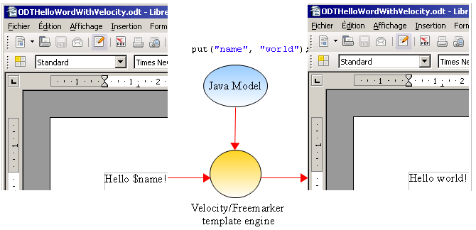
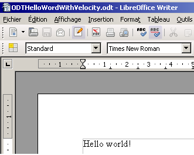

# 概述

## 什么是 XDocReport

**XDocReport用于将** [MS Office](http://office.microsoft.com/fr-fr/) \(**docx, pptx**\)，[OpenOffice](http://www.openoffice.org/) \(**odt**\)，[LibreOffice](http://www.libreoffice.org/) \(**odt**\)创建的 XML 文档与 Javam模型（Java Model）合并以生成文档并将其转换为其他格式（PDF、XHTML...）。

使用XDocReport的步骤：

1. 使用 MS Word（docx、pptx）或 OpenOffice（odt、ods）创建文档
2. 使用 Velocity 或 Freemarker 语法来设置要替换的变量。例如，您可以输入您的文档（此处使用 Velocity 语法）：`Hello $name`
3. 通过将文档与来自 Java 模型的值“world”合并来替换变量以生成包含指定内容的文档：`Hello world !`

## XDocReport in Action实战

### XDocReport 特性（了解即可）

XDocReport 是模块化的并且非常轻巧（无需在服务器中安装 MS Office、LibreOffice）。您可以选择要管理的 XML 文档类型（docx、odt...）并选择要使用的模板引擎 。如果您需要将报告生成转换为另一种格式（PDF...），请切换文档中使用的语法并选择转换器.

1. 您使用以下工具创建报告：

   - OpenOffic（支持 odt,ods 格式）

   - MS Word （支持 docx 格式）

2. 使用模板引擎并切换您喜欢的语法：

   - Freemarker : `Hello ${name} !` 

   - Velocity : `Hello $name !`

3. 当二次生成文档时，通过缓存模板（数据来自压缩的 XML 文档条目）提高文档生成速度
4. 文档生成中过程调试。
5. 表内循环（Loop for table）：_待改进_
6. 动态图片管理：_待开发_
7. 在 OSGi 环境中管理 XDocReport：_待开发_
8. 在 WEB 环境中管理 XDocReport：实现 AbstractXDocReportServlet。
9. 转换为其他种格式：XDocReport 提供了多种转换器（ODT 2 PDF、Docx 2 PDF...）来转换文档。转换器可用于转换文档或在生成报告后将报告转换为另一种格式。

XDocReport 是模块化的，这也就意味着：

1. 你可以实现自己的模板引擎。默认情况下实现了 Velocity 和 Freemarker。
2. 你可以实现自己的转换器。XDocReport 如今实现了 ODT 2 PDF（通过 ODFDOM+iText 和 Docx 2 PDF（通过 POI+iText））

## XDocReport API

XDocReport 让您能够：

1. 从源格式到源格式生成报表（例如：ODT 2 ODT）
2. 将文档转换为另一种格式（例如：ODT 2 PDF）
3. 生成报告并将其转换为源格式以外的另一种格式

### 报表生成

假设有文档 ODTHelloWordWithVelocity.odt，其中包含：`Hello $name!`



代码如下：

```text
// 1) 加载 ODT 文件并设置 Velocity 模板引擎并将其缓存到registry
InputStream in= new FileInputStream(new File("ODTHelloWordWithVelocity.odt"));
IXDocReport report = XDocReportRegistry.getRegistry().loadReport(in,TemplateEngineKind.Velocity);

// 2) 创建 Java 模型上下文（IContext）
IContext context = report.createContext();
context.put("name", "world");

// 3) 通过将 Java 模型与 ODT 合并生成报表
OutputStream out = new FileOutputStream(new File("ODTHelloWordWithVelocity_Out.odt"));
report.process(context, out);
```

此示例生成拥有以下内容的 ODTHelloWordWithVelocity\_Out.odt 报表：

`Hello world!`



### Converter

以下是将 ODT 格式转换为 PDF 格式的示例：

```text
// 1)创建ODT 2 PDF的Options
Options options = Options.getFrom(DocumentKind.ODT).to(ConverterTypeTo.PDF);

// 2) 从registry中获取converter（IConverter）
IConverter converter = ConverterRegistry.getRegistry().getConverter(options);

// 3) 将 ODT 转换为 PDF
InputStream in= new FileInputStream(new File("ODTHelloWord.odt"));
OutputStream out = new FileOutputStream(new File("ODTHelloWord2PDF.pdf"));
converter.convert(in, out, options);	
```

注意：默认情况下，ODT 2 PDF 转换器使用 ODT-&gt;XSL-FO-&gt;FOP 完成。

### 使用 Converter 生成报告

以下是一个使用 Velocity 从 ODT 生成报告并将其转换为 PDF 的示例：

```text
// 1) 加载 ODT 文件并设置 Velocity 模板引擎并将其缓存到registry
InputStream in= new FileInputStream(new File("ODTHelloWordWithVelocity.odt"));
IXDocReport report = XDocReportRegistry.getRegistry().loadReport(in,TemplateEngineKind.Velocity);

// 2) 创建 Java 模型上下文（IContext）
IContext context = report.createContext();
context.put("name", "world");

// 3) 设置PDF为格式转换器
Options options = Options.getTo(ConverterTypeTo.PDF);

// 4) 通过将 Java 模型与 ODT 合并生成报告并将其转换为 PDF
OutputStream out = new FileOutputStream(new File("ODTHelloWordWithVelocity_Out.odt"));
report.convert(context, options, out);
```

注意：XDocReport 提供默认转换器，但您可以根据需要实现自己的转换器。


  


